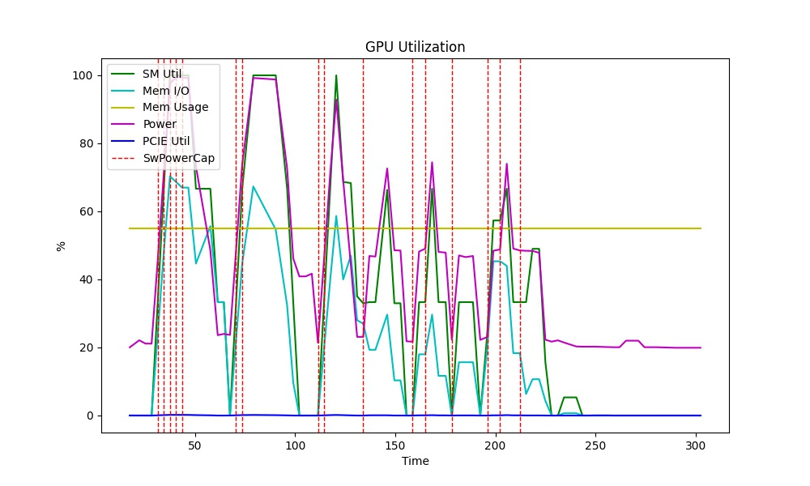
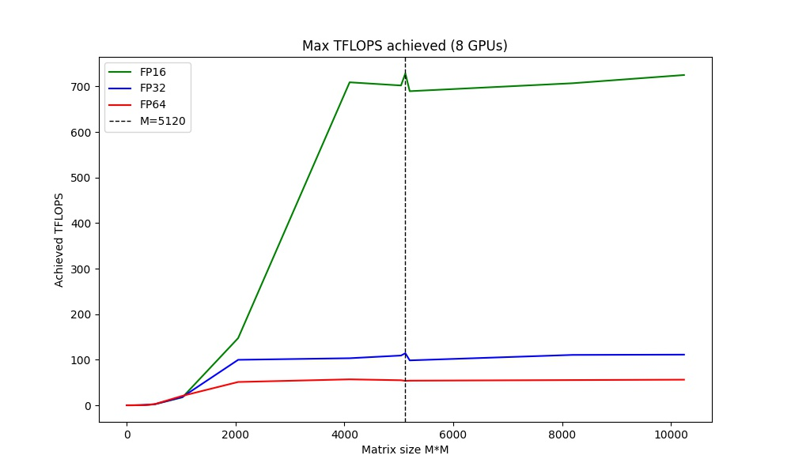

# TensorFlow Benchmarks

## Setup Instructions

With this folder as working directory:

1. Pull NGC TensorFlow container: `docker pull nvcr.io/nvidia/tensorflow:20.02-tf2-py3`
2. `bash setup.sh`
3. Done!

## Synthetic Benchmark

### MatMul TFLOPS Benchmark

Performs a matrix multiplication benchmark test, returning the peak TFLOPS over a range of MatMul sizes.

```shell
python3 synthetic_benchmarks/tflop_sweep.py --num_gpus 8
```

On a DGX-1 (8 V100), you should get a result like the following:

```
Max TFLOPS achieved (8 GPUs)
============================
* FP64: 57 TFLOPS
* FP32: 116 TFLOPS
* FP16: 742 TFLOPS
```

| GPU Utilization | TFLOPS Plot |
| --------------- | ----------- |
|  |  |

### Continuous Stress Test

For a continuous stress test (`--time` in seconds) with TFLOPS readout:

```shell
# run for 3600s (1 hour)
python3 synthetic_benchmarks/tflop_meter.py --num_gpus 8 --time 3600
```

## Computer Vision

### ResNet-50 v1.5

Train ResNet-50 v1.5 (or other CNNs) using TensorFlow 2.1 and Horovod+NCCL. 

#### End-to-end Training

This will train a ResNet-50 v1.5 model from scratch on the [ImageNet2012 (ILSVRC 2012) dataset](http://www.image-net.org/challenges/LSVRC/2012/) and report the time taken and final validation accuracy.

```shell
/usr/local/mpi/bin/mpirun --allow-run-as-root -np 8 \
  -bind-to none -map-by slot \
  -x LD_LIBRARY_PATH -x PATH \
  -mca pml ob1 -mca btl ^openib \
  python3 cnn_train_hvd.py \
    --xla --amp --batch_size 512 --lr 0.8 \
    --dataset imagenet2012 --data_dir=/raid/tensorflow_datasets \
    --epochs 90 --img_aug --ctl
```

Explanation of flags:

* `--xla`: use XLA compiler to improve performance
* `--amp`: use Automatic Mixed Precision to improve performance using Tensor Cores
* `--batch_size`: batch size **per GPU**
* `--img_aug`: use basic image augmentation
* `--ctl`: use custom training loop (better performance)
* `--dataset`: specifies the dataset name (`imagenet2012` or other TFDS datasets like `imagenette/320px`). Note that you must download ImageNet2012 manually [following these instructions](https://www.tensorflow.org/datasets/catalog/imagenet2012)
* `--data_dir`: TensorFlow Datasets (`tensorflow_datasets`) folder location

#### Image/sec Performance Measurement

Alternate launch script to get direct training throughput (images per second) measurement.

```shell
/usr/local/mpi/bin/mpirun --allow-run-as-root -np 8 \
  -bind-to none -map-by slot \
  -x LD_LIBRARY_PATH -x PATH \
  -mca pml ob1 -mca btl ^openib \
  python3 cnn_train_hvd.py \
    --xla --amp --batch_size 512 \
    --dataset imagenette/160px --data_dir=/raid/tensorflow_datasets \
    --epochs 10 --ctl --steps 100 --no_val --verbose 2
```

#### Alternate Models

Default model is MLPerf ResNet-50 V1.5. Other CNN models can be specified:

* `--rn50v2`: ResNet-50 V2
* `--rn152`: ResNet-152 V2
* `--dn201`: DenseNet-201
* `--mobilenet`: MobileNet V2

#### Alternate Implementation

This uses TensorFlow 2.1 and tf.distribute+NCCL to do the distributed training.

**End-to-end Training**

```shell
python3 cnn_train_tfdist.py \
  --xla --amp --batch_size 256 --lr 0.8 --epochs 90 \
  --dataset imagenet2012 --data_dir=/raid/tensorflow_datasets --img_aug
```

**Image/sec Performance Measurement**

```shell
python3 cnn_train_tfdist.py --verbose 2 \
  --xla --amp --batch_size 256 --epochs 10 --steps 100 --no_val \
  --dataset imagenette/160px --data_dir=/raid/tensorflow_datasets
```

## Natural Language Processing

### BERT-Large Fine-tuning

```shell
/usr/local/mpi/bin/mpirun --allow-run-as-root -np 8 \
    -bind-to none -map-by slot \
    -x LD_LIBRARY_PATH -x PATH \
    -mca pml ob1 -mca btl ^openib \
    python3 xfmer_horovod.py \
      --amp  --epochs 2 --batch_size 16 --interval 10 --warmup_prop 0.5 \
      --task qqp --maxseqlen 64 --model bert-large-cased-whole-word-masking \
      --lr 0.00004
```


