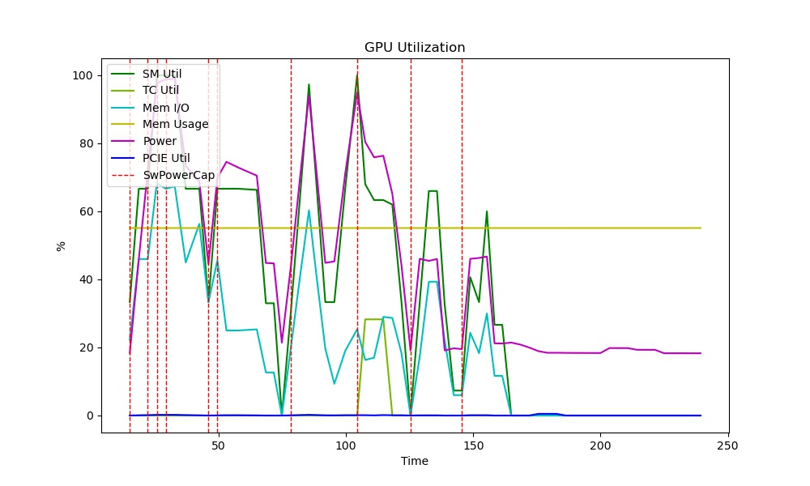
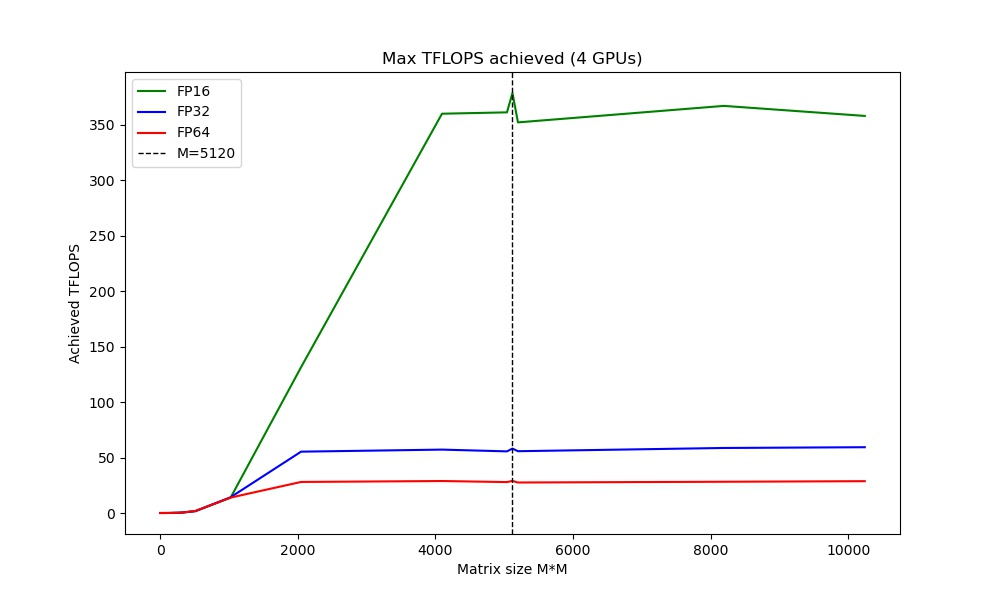
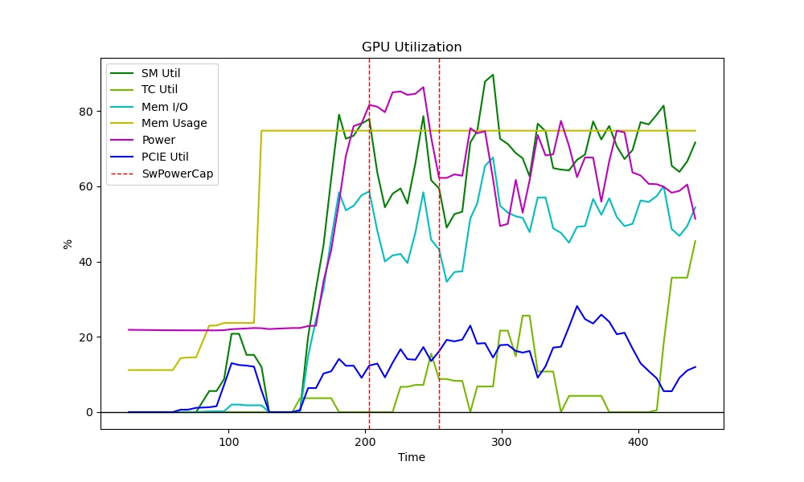
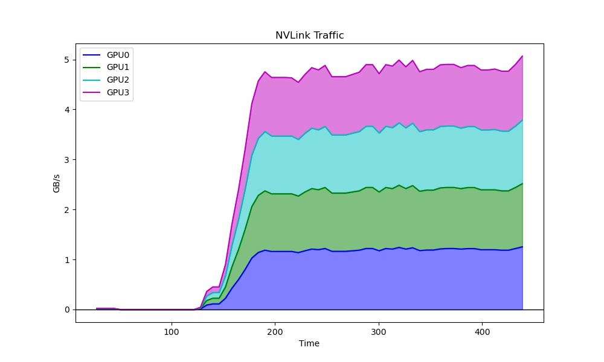
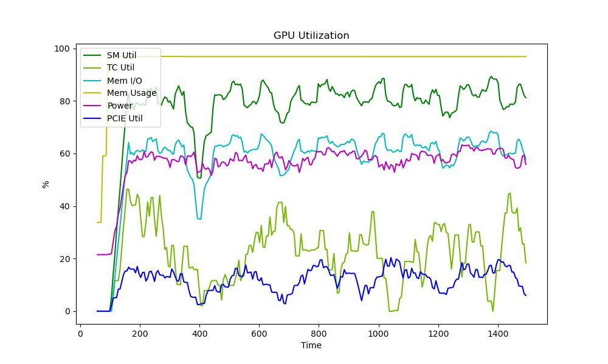
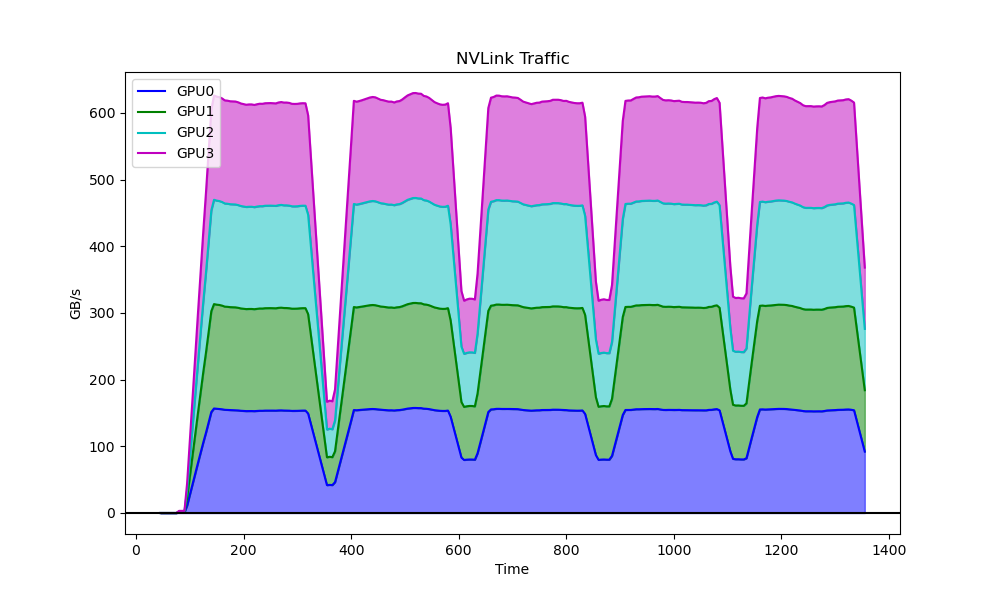

# TensorFlow Benchmarks

## MatMul Benchmark

Performs a matrix multiplication benchmark test, returning the peak TFLOPS.

```shell
python3 gpu_burn.py --num_gpus 8
```

On a DGX-1 (8 V100), you should get a result like the following:

```
Max TFLOPS achieved (8 GPUs)
============================
* FP64: 57 TFLOPS
* FP32: 116 TFLOPS
* FP16: 742 TFLOPS
```

On DGX Station (4 V100):

| GPU Utilization | TFLOPS Plot |
| --------------- | ----------- |
|  |  |

## Image Classification

### Test Case 1 ("small CNN")

* Model: ResNet-50
* Framework: TF2.1 + tf.distribute
* Uses NCCL: Yes

```shell
python3 resnet_tfdist.py --xla --amp --batch_size 256 --lr 0.5 --img_aug --epochs 90 --dataset imagenette/320px
```

| V100 | Training time | Images/sec | Val Acc |
| ---- | ------------- | ---------- | ------- |
| 4    | 570s          | 4648       | 0.85    |

| GPU Utilization | NVLink Utilization |
| --------------- | ------------------ |
|  |  |

### Test Case 2 ("big CNN")

* Model: DenseNet-201
* Framework: TF2.1 + tf.distribute
* Uses NCCL: Yes

```shell
python3 resnet_tfdist.py --xla --amp --img_size 256 --batch_size 64 --lr 0.5 --img_aug --epochs 90 --dataset imagenette/320px --dn201
```

## Transformer Fine-tuning

### Test Case 1 ("big Transformer")

```shell
mpirun -np 4 \
    -bind-to none -map-by slot \
    -x NCCL_DEBUG=INFO -x LD_LIBRARY_PATH -x PATH \
    -mca pml ob1 -mca btl ^openib \
    python3 xfmer_horovod.py \
    --amp  --epochs 1 --batch_size 20 --interval 10 --warmup_prop 0.3 \
    --task qqp --maxseqlen 64 --model xlm-mlm-en-2048 \
    --lr 0.00002
```

| V100 | Training time | Examples/sec | Val Acc |
| ---- | ------------- | ------------ | ------- |
| 4    | 1675s         | 67           | 0.8093  |

| GPU Utilization | NVLink Utilization |
| --------------- | ------------------ |
|  |  |

